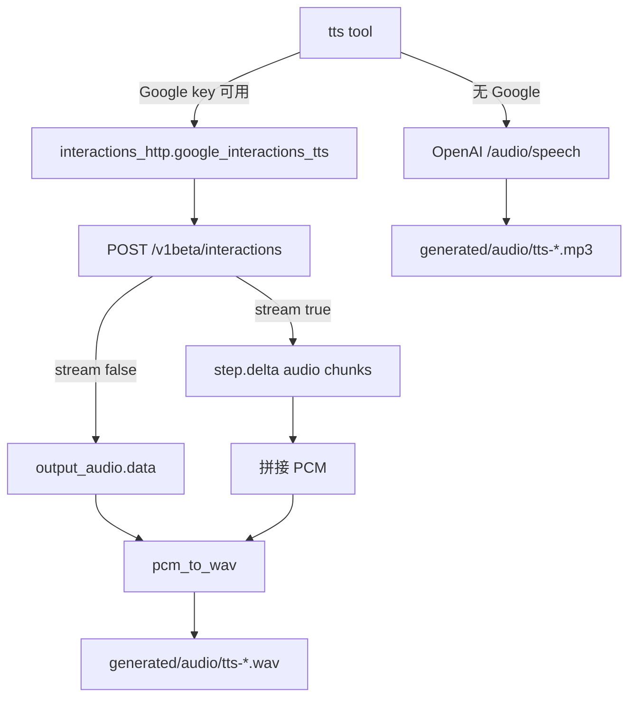

# TTS Interactions API Implementation Plan

> **For agentic workers:** REQUIRED SUB-SKILL: Use superpowers:subagent-driven-development (recommended) or superpowers:executing-plans to implement this plan task-by-task.

> **Plan status:** Completed on `main`（2026-07-16）。实现已落地；勿再按本计划重复开工。

**Goal:** 将 Google `tts` 升级到 Gemini Interactions API（单/多说话人、style、stream 落盘），OpenAI `/audio/speech` 保持独立备用。

**Architecture:** 新建 / 扩展 `providers::interactions_http`（TTS 请求/解析/流式 + 共用 URL/auth）；`tools` 层 Google 直连该 helper，失败不回退 OpenAI。

**Tech Stack:** Rust (`providers` / `tools`)、`reqwest`、`serde_json`、`base64`、复用 `media_http::pcm_to_wav`。

**参考:** `docs/superpowers/specs/2026-07-16-tts-interactions-api-design.md`；[Speech Generation](https://ai.google.dev/gemini-api/docs/speech-generation?hl=zh-cn)

## Global Constraints

- Google：`POST {google_native_base}/v1beta/interactions`，Header `x-goog-api-key`（不用 Bearer / `?key=`）。
- 默认模型：`gemini-3.1-flash-tts-preview`。
- Google 失败：**不**回退 OpenAI / generateContent；仅当未配置 Google 时才走 OpenAI。
- 多说话人最多 2；PCM → WAV 24kHz mono 16-bit。
- 流式语义：工具侧聚合 PCM chunk → 最终一档 WAV（不接前端实时播放）。
- 非流式 HTTP 500：最多重试 2 次（官方偶发 text token→500）。
- OpenAI：只使用 `text` + `voice`；`speakers` / `style` / `stream` → 结果加 `note:`。

## File Structure

| File | Responsibility |
|------|----------------|
| `providers/src/protocol/interactions_http.rs` | TTS 类型、body、解析、流式、HTTP |
| `providers/src/protocol/mod.rs` | `pub mod interactions_http` |
| `providers/src/lib.rs` | re-export |
| `providers/src/protocol/media_http.rs` | 弃用注释 `google_tts_generate` |
| `tools/src/builtins/media/tts.rs` | Args 扩展、校验、接线 |

## 架构（落地）

---

### Task 1: interactions_http TTS

**Files:** Create/Modify as above.

**Interfaces:**

- `InteractionSpeechConfig { speaker: Option<String>, voice: String }`
- `InteractionTtsRequest { model, input, speech_config, stream }`
- `InteractionTtsResult { wav_bytes, interaction_id }`
- `build_interaction_tts_body` / `parse_interaction_tts_response` / `parse_tts_stream_events`
- `build_tts_input`（style + TRANSCRIPT 序言）
- `google_interactions_tts`
- 共用：`interactions_url(config)`、`x-goog-api-key`

**HTTP 细节：**

- Body：`model`、`input`、`response_format: { "type": "audio" }`、`generation_config.speech_config`、可选 `stream`
- 非流式：解析 `id` + `output_audio.data` → `pcm_to_wav`
- 流式：Header `Api-Revision: 2026-05-20`；读 SSE/NDJSON，取 `event_type=step.delta` 且 `delta.type=audio`

- [x] 实现 + 单测（body、非流式解析、流式 chunk、style→input、URL 去 `/openai`）

### Task 2: tts 工具接线

- [x] 扩展 `TtsArgs`（`speakers` / `style` / `stream`）
- [x] Google → `google_interactions_tts`；有 Google 失败不静默改 OpenAI
- [x] 无 Google 才 OpenAI；高级参数附 `note:`
- [x] 更新 tool description

### Task 3: 弃用旧路径

- [x] `media_http::google_tts_generate` 文档 + `#[deprecated]` 标注；工具不再调用

### Task 4: 验证

- [x] `cargo test -p providers interactions_http`
- [x] `cargo test -p tools --lib -- tts`；`cargo check -p tools`

## 非目标（勿再扩本计划）

- 前端实时播放 UI
- Live API 交互语音
- 先用其它模型生成播客剧本再 TTS
- 改造 OpenAI 路径以镜像 `speakers` / `style`
