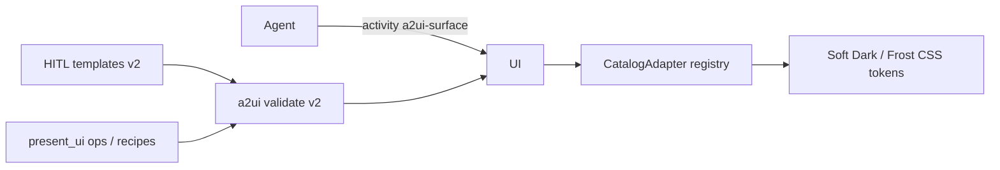

# A2UI Glass Catalog v2 Design

> **Status:** Approved  
> **Date:** 2026-07-13  
> **Related:** [Declarative GenUI A2UI](./2026-07-13-declarative-genui-a2ui-design.md)、[AG-UI ↔ A2UI 映射](./2026-07-13-agui-a2ui-astro-mapping.md)

## Goal

完善 `a2ui` 库与前端渲染器：在可信 catalog 内支持**多组件自由组合**的漂亮卡片，默认 **玻璃拟态**，并随应用 **亮/暗主题**切换 token；HITL 继续走精美模板，信息/表单卡允许模型组合 + 校验。

## Decisions（已拍板）

| 项 | 选择 |
|----|------|
| 范围 | 扩展 catalog/模板 **+** 玻璃视觉体系 |
| 卡片场景 | HITL 确认/澄清、信息/结果卡、自由组合内容卡、表单交互卡（全做） |
| 玻璃气质 | Soft Dark（暗色）+ Frost（亮色）；跟 `html[data-theme]` |
| AI 产出 | **混合**：HITL 精美模板；`present_ui` 快捷模板或自由 `operations` |
| 实现路径 | **Astro 扩展 Catalog**（方案 2），非纯 CSS、非纯 basic 深嵌套 |
| Catalog ID | `astro://a2ui/catalog/v2`（替换 v1；模板与校验同步升级） |

## Non-goals（本期）

- 实现 Modal / Tabs / Slider / DateTimeInput / Video / AudioPlayer（**预留扩展点**，标为 v2.1+）
- 完整 `updateDataModel` 双向数据绑定
- 替换为官方 A2UI renderer
- 组件 JSON 内写死颜色 / hex

---

## 1. Architecture

**目标：** catalog 升到 v2 = A2UI basic 子集 + Astro 设计系统叶子组件；前端统一玻璃渲染；传输与 interrupt 生命周期不变。

| Unit | Responsibility | Depends on |
|------|----------------|------------|
| `a2ui` crate | allowlist、校验、HITL/info/recipe 模板 | serde_json |
| `CatalogAdapter` | 组件名 → React；注册表式扩展 | types / validate |
| `chat.css` a2ui 段 | 亮暗玻璃 token | `html[data-theme]` |
| `confirm` / `clarify` / `present_ui` | 模板升级；自由 ops 校验 | a2ui |
| Tool / prompt 文案 | 列出 v2 积木与组合示例 | — |

**数据流：** 仍为 Agent → gRPC `activity` → Tauri → React；HITL 仍 `run_finished(interrupt)`。

---

## 2. Catalog v2

### 2.1 Identity

- `ASTRO_CATALOG_ID = "astro://a2ui/catalog/v2"`
- `createSurface.catalogId` 必须等于该值，否则校验失败
- 前端 `ALLOWED_COMPONENTS` 与 Rust allowlist **同源集合**

### 2.2 Basic（保留）

`Text`, `Icon`, `Divider`, `Card`, `Column`, `Row`, `Button`, `TextField`, `ChoicePicker`, `CheckBox`, `Image`, `List`

### 2.3 Astro 扩展（本期新增）

| Component | Role | Key props |
|-----------|------|-----------|
| `Badge` | 状态标签 | `text`, `variant`: success \| warn \| danger \| info |
| `Chip` | 轻标签 | `text`, optional `action` |
| `Metric` | 指标块 | `label`, `value`, optional `hint` |
| `Avatar` | 头像/图标容器 | `name` (icon) 或 `text` (initials), optional `src` |
| `Callout` | 提示条 | `text`, `variant`: info \| warn |
| `Spacer` | 间距 | `size`: sm \| md \| lg |

### 2.4 Theme / glass tokens

- 组件 **不**携带颜色字段；仅 `variant` / 语义
- CSS 变量（示意）：`--a2ui-glass-bg`, `--a2ui-glass-border`, `--a2ui-glass-blur`, `--a2ui-glass-shadow`
- `html[data-theme="dark"]` → Soft Dark（半透明白叠加深色底 + blur）
- `html[data-theme="light"]` → Frost（半透明白/浅色 + blur + 轻阴影）
- `Card` / `Button` / 输入框 / 扩展组件全部吃同一套 token

### 2.5 Forward compatibility（v2.1+）

下列组件本期 **校验拒绝**，但文档与 Adapter 结构按「加一条映射即可」设计：

`Modal`, `Tabs`, `Slider`, `DateTimeInput`, `Video`, `AudioPlayer`

接入步骤：allowlist → 前端 map → 可选模板 → 测试。

---

## 3. Templates, forms, AI composition

### 3.1 HITL templates

- `build_confirm_surface` / `build_clarify_surface` 升 v2 结构：  
  `Card` → `Column` →（可选 `Avatar`/`Badge`）+ 标题 `Text` + 正文 + `Row` 按钮（或选项按钮）
- 澄清可使用真正可交互的 `ChoicePicker` / `TextField` + 提交 `Button`（不再长期占位）

### 3.2 Info / composite

| Path | Mechanism | Interrupt? |
|------|-----------|------------|
| 快捷 `title`/`body`/`image_url` | 升级 `build_info_surface`（可含 Metric 行） | No |
| 自由 `operations[]` | v2 validate → activity | No |
| Recipes（可选） | `result` / `metrics` / `callout` 辅助模板，供工具或文档引用 | No |

### 3.3 Forms

- MVP：控件本地 React state；提交时 Button `action.context` 携带字段值 → `interrupt_resume` 或 `ui_action`
- 协议保留 `updateDataModel`；本期不做完整双向绑定

### 3.4 AI guidance

- 更新 `present_ui` 与相关 tool 描述：列出 v2 组件 + 2～3 个组合 JSON 示例
- 约定：根节点优先 `Card`；只用 `variant` 表达语义；禁止 hex 颜色

---

## 4. Error handling & testing

### Errors

| Case | Behavior |
|------|----------|
| 校验失败（未知组件、错误 catalogId、结构坏） | 不渲染该 surface；工具返回明确错误 |
| 未知组件漏网 | 单节点 `a2ui-unknown` fallback，不拖垮整卡 |
| 表单缺必填 | 前端禁用提交或提示；resume 不符 schema 则拒绝 |
| 主题切换 | 纯 CSS；无额外错误路径 |

### Testing

- Rust：v2 allowlist；各模板 `validate_operations`；拒绝 v1 catalogId 与未实现组件名
- 前端：Adapter 覆盖扩展组件 + 表单可交互；亮/暗主题下玻璃 class smoke

---

## 5. File touch map（实现时参考）

| Area | Files (expected) |
|------|------------------|
| Catalog / validate / templates | `a2ui/src/catalog.rs`, `validate.rs`, `templates.rs`, tests |
| Frontend types / adapter / CSS | `frontend/src/a2ui/*`, `frontend/src/styles/chat.css` |
| Tools | `tools/src/builtins/{confirm,clarify,present_ui}.rs` |
| Docs cross-link | 更新 declarative GenUI spec 中 catalog 小节指向本文 |

---

## Success criteria

1. 暗色与亮色下 A2UI 卡片均为可读玻璃拟态，无硬编码色差撕裂  
2. HITL 确认/澄清卡视觉升级且行为不变（interrupt/resume）  
3. `present_ui` 可自由组合 Badge/Metric/Callout 等并通过校验  
4. TextField / ChoicePicker / CheckBox 可真实交互并提交  
5. 新增 Modal 等时只需 allowlist + Adapter 条目，无需重做架构  
