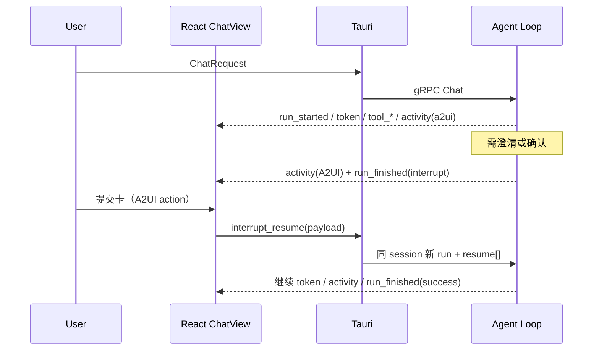

# Declarative GenUI（A2UI via AG-UI）Design

> **Status:** Implemented  
> **Date:** 2026-07-13  
> **Related:** [Astro ↔ AG-UI ↔ A2UI 映射表](./2026-07-13-agui-a2ui-astro-mapping.md)

## Goal

在 Astro 聊天中落地**声明式 Generative UI**：Agent 经对齐 AG-UI 语义的事件流下发 A2UI surface，前端用可信 catalog 渲染澄清、确认/授权、信息卡等；HITL 使用真正的 AG-UI interrupt / resume。

## Decisions（已拍板）

| 项 | 选择 |
|----|------|
| GenUI 模式 | 声明式：A2UI，经 AG-UI 语义传输 |
| 接入深度 | **B2**：原生实现 AG-UI 事件语义，传输仍为 gRPC → Tauri |
| 实现策略 | **方案 1**：增量扩展现有 `ChatEvent`，不换 HTTP/SSE 主通道 |
| 首期卡片 | 澄清 + 确认/授权 + 信息卡（都做） |
| A2UI 产出 | **混合**：HITL 走模板工具；信息卡允许 catalog 内组合（须校验） |
| 渲染器 | **自研子集 + CatalogAdapter**（可日后替换官方 renderer） |
| HITL | **真 Interrupt**：澄清与确认均 `RunFinished.outcome.interrupt` |

## Non-goals（本期）

- 完整 AG-UI HTTP/SSE 服务端或 CopilotKit 整包接入
- `STATE_SNAPSHOT` / `STATE_DELTA` 双向共享状态
- A2UI Modal / Tabs / Slider / DateTimeInput / Video / AudioPlayer
- 双通道（主聊天 + 独立 agui-stream）

---

## 1. Architecture & data flow

**路径：** `Agent loop → gRPC ChatEvent → Tauri emit → React`（与现网一致）。



### Module boundaries

| Unit | Responsibility | Depends on |
|------|----------------|------------|
| Agent loop | Emit AG-UI-equivalent events; interrupt state machine | tools, streaming |
| HITL tools | `confirm` + redesigned `clarify` → template A2UI + interrupt | A2UI templates |
| Info-card path | Tool/model A2UI → catalog validate → `activity` only | validator |
| Proto / Tauri | `activity`, `run_finished.outcome`, `interrupt_resume`; stream control renamed | existing Chat |
| `A2UIRenderer` + `CatalogAdapter` | Map operations → React; swappable backend | ChatView |
| Mapping doc | Event name ↔ AG-UI reference | — |

气泡顺序：`attachments → tool activities → uiSurfaces (A2UI) → reasoning → markdown`。

---

## 2. Event contract & interrupt lifecycle

### Downstream (Agent → UI)

| Event | Role | AG-UI equivalent |
|-------|------|------------------|
| Keep `token`, `reasoning`, `tool_call_delta`, `tool_call`, `memory_update`, `usage`, `error` | Unchanged behavior | Text / Reasoning / ToolCall* |
| Add `run_started { thread_id, run_id }` | One user send = one run | `RUN_STARTED` |
| `run_finished { run_id, outcome }` | Prefer over bare `done`; `done` may remain as compat alias | `RUN_FINISHED` |
| `outcome` | `success` \| `interrupt { interrupts[] }` | same |
| Add `activity { message_id, activity_type, content, replace? }` | A2UI: `activity_type = "a2ui-surface"`, `content.operations = [...]` | `ACTIVITY_SNAPSHOT` |
| Optional later: `activity_delta` | JSON Patch; MVP uses full snapshot + `replace: true` | `ACTIVITY_DELTA` |

Errors remain `error` ≈ `RUN_ERROR` (not an `outcome` variant).

### Interrupt object

```text
Interrupt {
  id,
  reason: "tool_call" | "input_required" | "confirmation",
  message?,
  tool_call_id?,
  response_schema?,
  expires_at?,
  metadata?
}
```

- Confirm/auth: `confirmation` or tool-bound `tool_call`
- Clarify: `input_required` + `response_schema`
- Emit matching `activity` (A2UI card) **before** `run_finished(interrupt)`

### Upstream (UI → Agent) — split from stream control

| Action | Meaning |
|--------|---------|
| `stream_pause` / `stream_resume` / `cancel` | Existing stream control (rename away from bare `resume`) |
| `interrupt_resume { thread_id, resume: [{ interrupt_id, status, payload? }] }` | Resolve all open interrupts; same session |
| `ui_action` (A2UI `action`) | In-card click; may include `a2uiClientDataModel`. HITL submits usually fold into `interrupt_resume.payload` |

### Contract rules

1. While interrupts are open, plain `ChatRequest` on that session is **rejected** unless it carries `interrupt_resume` → `error`.
2. Read-only info cards emit `activity` only; run ends `success` (no interrupt).
3. `cancel` during interrupt pending marks open interrupts `cancelled` and clears pending state (no auto-continue).
4. `stream_pause` only pauses generation; it **cannot** answer an interrupt.
5. Persist `activity` / surfaces with messages; unresolved interrupts survive reload until expiry.

Detailed AG-UI ↔ Astro field mapping: see mapping doc.

---

## 3. Catalog, renderer, tools

### Catalog subset

- `catalogId`: `astro://a2ui/catalog/v2`
- Shape aligned with A2UI basic catalog plus Astro extension components; see [A2UI Glass Catalog v2](./2026-07-13-a2ui-glass-catalog-v2-design.md) for full allowlist, glass tokens, and templates.

| Components | Use |
|------------|-----|
| Text, Icon, Divider | Copy / chrome |
| Card, Column, Row | Layout |
| Button | Submit / choices |
| TextField, ChoicePicker, CheckBox | Clarify / forms |
| Image, List | Info cards |
| Badge, Chip, Metric, Avatar, Callout, Spacer | Astro extensions — status, metrics, avatars, callouts, spacing |

**Out of MVP:** Modal, Tabs, Slider, DateTimeInput, Video, AudioPlayer (forward-compat extension points reserved in glass catalog v2 design, v2.1+).  
**Validation functions MVP:** `required` only; others as needed.

### Renderer adapter

```text
A2UIOperations → CatalogAdapter.resolve(component) → React nodes
```

- Unknown component → placeholder; do not fail the whole surface
- Validation failure → no render of bad surface; log; optional client `error` envelope
- Styling via existing `chat.css` tokens; interactive surfaces may use card chrome

### Production paths (hybrid)

| Path | Mechanism | Interrupt? |
|------|-----------|------------|
| `confirm` tool | Args → fixed A2UI template → `activity` + interrupt | Yes |
| `clarify` tool | `questions[]` → `ClarifyWizard` A2UI surface; no text fallback | Yes (`input_required`) |
| Info cards | Tool result or model A2UI JSONL → **catalog validate** → `activity` | No |

HITL templates live as checked-in JSON/Rust constants. Info-card JSON must pass validation before render.

### User submit

- Clarify/confirm: A2UI `action` → `interrupt_resume.payload` (must match `response_schema`)
- Info-card local actions (`openUrl`): client-only; Agent follow-ups via `ui_action` as normal continuation (not interrupt)

---

## 4. Error handling, persistence, testing

### Errors

| Case | Behavior |
|------|----------|
| A2UI validation fail | Do not render; optional error activity; agent logs |
| Payload ≠ `response_schema` | Reject resume; UI hint; no new run |
| Partial interrupt coverage | `error` |
| Chat while pending interrupt | `error` |
| Past `expires_at` | `error`; disable submit |
| `cancel` while pending | Mark interrupts `cancelled`; clear pending |

### Persistence

- `ChatMessage.uiSurfaces`: operations snapshot + status (`active` \| `resolved` \| `cancelled`)
- Interrupt metadata stored with session for resume after reload (if not expired)
- History reload: completed cards read-only; pending cards keep submit UI

### Tests (MVP)

1. Unit: catalog validation; `clarify`/`confirm` templates emit valid operations  
2. Unit: interrupt state machine (pending → resume → success; reject partial resume)  
3. Integration: `activity` + `run_finished(interrupt)` → `interrupt_resume` → continued tokens  
4. Frontend: renderer smoke for subset; unknown-component degradation  
5. Regression: plain chat, tool activity cards, `stream_pause`/`cancel` unchanged  

### Acceptance (MVP)

- Confirm and clarify cards block the run and resume correctly  
- At least one info-card type renders without interrupt  
- Mapping-doc P0 events implemented or documented as compat aliases  

### Rollout order

1. Proto/Tauri event + `interrupt_resume` / stream-control rename  
2. Agent interrupt state machine  
3. `confirm` template + A2UI renderer subset  
4. Migrate `clarify` to interrupt  
5. Info-card path + validator  
6. Persistence + history restore  

---

## Open points (resolved in design)

- Transport: stay on gRPC/Tauri (B2), not HTTP AG-UI endpoint in MVP.  
- Soft-pause HITL: rejected; both clarify and confirm use true interrupt.  
- Dual chat streams: rejected.
