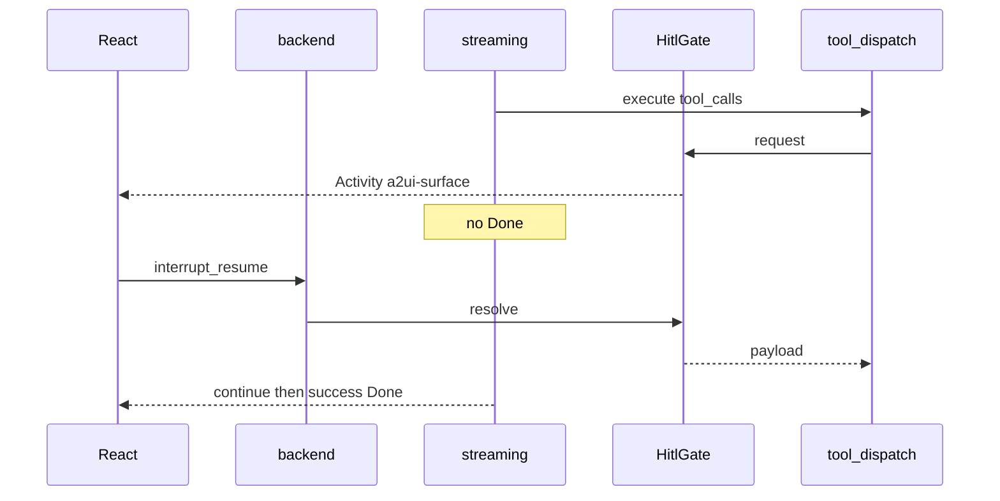

# HITL 阻塞回调 + 多工具并发（Hermes 对齐）

**日期:** 2026-07-13  
**状态:** 已批准 / 已实现  
**范围:** 第一竖切——同回合 HITL 阻塞闸门、多工具批并发策略、terminal 危险命令审批  
**非目标:** 派生/协作重写、`delegate_task` 真 spawn、Hermes smart 辅模型自动审批

## 目标

对齐 Hermes 行为，同时保留 A2UI 卡片 UI：

1. `confirm` / `clarify` / 危险命令审批在工具路径上 **park**；用户提交后写入 **标准 tool result**，**同一 run 继续**。
2. 同批 `tool_calls`：无 interactive/exclusive 时 **并发**；否则 **整批串行**。

## 相对旧 GenUI 决策的变更

[`2026-07-13-declarative-genui-a2ui-design.md`](./2026-07-13-declarative-genui-a2ui-design.md) 曾规定 HITL 必须 `RunFinished(outcome=interrupt)` 并新开 run + resume。本竖切改为：

| 项 | 旧 | 新 |
|----|----|----|
| 等待形态 | 结束 run | 同 run 内 `HitlGate` park，流不发 `Done` |
| 用户回复 | `[interrupt_resume]` user 消息 | 完成 oneshot → tool result |
| 卡片 | A2UI Activity | 不变（仍 Activity） |
| RPC | `interrupt_resume` | 保留，语义改为 resolve 活闸门 |

## 架构

### HitlGate

- `request(session, HitlRequest) -> HitlResolution`：注册 oneshot、emit Activity、等待 resume/cancel/timeout（默认 600s）
- `resolve(session, ResumeItem[])`：完成对应 oneshot
- 超时：sentinel tool result，不崩 run
- `interrupt.json`：可选 UI 刷新；无活 oneshot 时不可假续跑

### 多工具批

- `ToolEntry.interactive`：`confirm` / `clarify`
- `ToolEntry.exclusive`：`memory_*` / `create_agent` 等需 `&mut MemoryManager`
- 批内任一 interactive/exclusive → 整批串行；否则 `JoinSet` 并发，按原序写回 tool results

### Terminal 审批

- `tools/approval.rs`：危险命令 regex MVP
- 命中 → 同一 `HitlGate`（confirm 模板）；deny 不执行

## 验收

1. HITL 卡片后流未 Done；点选后同 run 续跑；历史为 `role=tool`
2. 非 exclusive 多工具并发且结果有序
3. 含 clarify 时串行；park 期间不跑后续工具
4. 危险 terminal 审批；deny 不执行
5. 取消/超时不泄漏挂起任务
