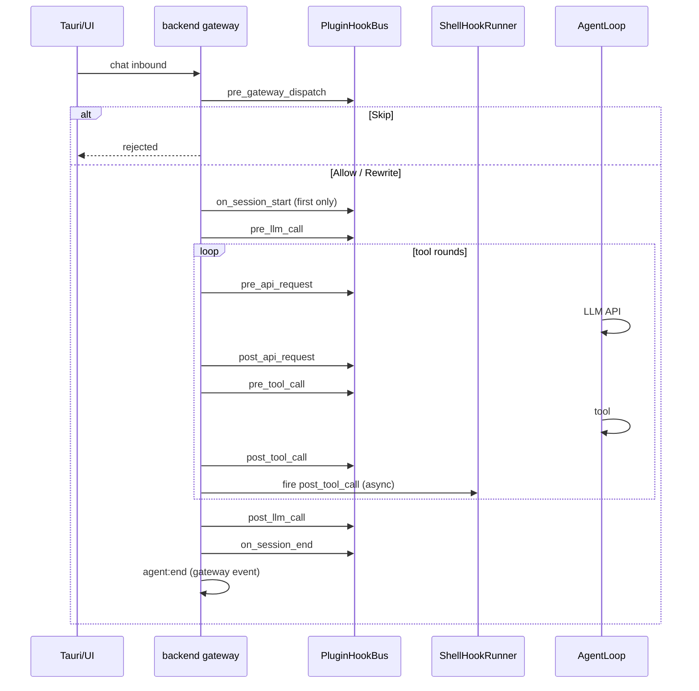

# Astro 三套 Hook 体系（对齐 Hermes 生命周期语义）

**日期:** 2026-07-14  
**状态:** 已批准 / 实现中  
**范围:** Plugin Hooks（Agent 生命周期）+ Gateway Event Hooks + Shell Hooks；Hermes 同款钩子名；进程内 Rust `register_hook`；UI 事件与 memory 分流；用户文档 `docs/hooks.md`  
**非目标:** 动态加载第三方 `.so`/Python 插件；Telegram 等 messaging 平台适配器（Gateway 事件先挂 gRPC/Tauri）；把 `EventBus` broadcast 复活为第三套 UI 通道

**外部参考（仅行为对照，代码/用户可见文案禁止 `hermes` 品牌字样）：**  
[Hermes Plugins · Available hooks](https://hermes-agent.nousresearch.com/docs/user-guide/features/plugins)

## 目标

1. 新建 workspace crate `hooks`，落地与 Hermes 对应的 **三套** 钩子体系。  
2. Agent 生命周期钩子名与 Hermes **一致**（`pre_llm_call`、`pre_tool_call` 等）。  
3. 进程内 `PluginContext::register_hook("post_tool_call", …)` 注册；可影响流程的钩子语义对齐 Hermes 常用集。  
4. Gateway / Shell 可运行：目录清单 + 配置驱动 shell；入站与会话生命周期接通。  
5. UI「Hook 事件」开关真正控制生命周期钩子展示；不再经 `MemoryUpdate` 伪装。  
6. 实现后写入 `docs/hooks.md`。

## 决策摘要

| 项 | 选择 |
|----|------|
| 架构 | 统一 `hooks` crate（方案 A） |
| 插件形态 | Rust 进程内注册，无动态库 |
| 可影响流程 | `pre_llm_call` 注入；`pre_tool_call` Block/Modify；`pre_gateway_dispatch` allow/skip/rewrite；其余观察 |
| 配置根 | `~/.astro`（`ASTRO_MEMORY_DIR` 可覆盖） |
| 旧代码 | `agent::PromptHooks` / `ChannelHooks` 迁移改名；`permissions::HookBus` 并入或薄转发后删除重复 |

## 架构

```text
hooks/
  lib.rs
  context.rs      # PluginContext::register_hook / register_gateway_handler
  plugin/         # PluginHookBus + 生命周期名常量
  gateway/        # HOOK.yaml 发现 + GatewayHookRegistry
  shell/          # config.yaml hooks: + ShellHookRunner
  config.rs       # 加载 ~/.astro/config.yaml
  ui.rs           # UiTimelineHooks（推 Chat 流）
  names.rs        # 钩子名字符串常量

agent  → 主循环点火 Plugin Hooks（含 API / 工具 / 会话轮次）
backend → 启动扫描、pre_gateway_dispatch、session/gateway 事件、挂 UiTimelineHooks
tools/delegate → subagent_stop
frontend → ChatEvent Hook 载荷 + showHooks 过滤
```



## Plugin Hooks（Agent 生命周期）

### 注册 API

```rust
fn register(ctx: &mut PluginContext) {
    ctx.register_hook("post_tool_call", |payload| {
        // 观察：返回 Continue
        HookOutcome::Continue
    });
}
```

内置在进程启动时调用若干 `register`（例如 `UiTimelineHooks`、可选 `LoggingHooks`）。测试用 `RecordingHooks`。

### 钩子表

| 钩子名 | 触发点（Astro） | 返回 / 影响 |
|--------|-----------------|-------------|
| `on_session_start` | 该 `session_id` 首次进入主循环 | 观察 |
| `pre_llm_call` | 每用户 turn 一次，拼 prompt / 调模型前 | 可选 `InjectContext(String)` 注入本轮用户侧附加上下文 |
| `pre_api_request` | 每次底层 `chat_stream`/completion 前 | 观察 |
| `post_api_request` | 同上结束后（含错误） | 观察 |
| `pre_tool_call` | 任意工具执行前 | `Continue` / `Block(reason)` / `Modify(args)` |
| `post_tool_call` | 工具返回后 | 观察 |
| `post_llm_call` | 该 turn 成功结束 | 观察 |
| `on_session_end` | 单次 `run_turn` / `stream_multi_turn` 结束 | 观察 |
| `on_session_finalize` | 内存卸会话、进程清理路径 | 观察 |
| `on_session_reset` | 新建对话 / 切走旧 session key | 观察 |
| `subagent_stop` | `delegate` 子 Agent 完成后（父侧） | 观察 |
| `pre_gateway_dispatch` | gRPC/Tauri chat 入站、入队前 | `Allow` / `Skip` / `Rewrite(content)` |

顺序：

```text
on_session_start（仅首轮）
  → pre_llm_call
  → [工具循环]
      → pre_api_request → API → post_api_request
      → pre_tool_call → 工具 → post_tool_call
  → post_llm_call
  → on_session_end
```

### 与旧命名映射（迁移期）

| 旧 `PromptHooks` / Channel kind | 新钩子名 |
|--------------------------------|----------|
| `on_prompt_build` / `hook:prompt_build` | `pre_llm_call`（prompt 观测并入；注入走 InjectContext） |
| `on_completion` / `hook:completion` | `post_llm_call` |
| `on_tool_call` / `hook:tool_call` | `pre_tool_call` |
| `on_tool_result` / `hook:tool_result` | `post_tool_call` |
| `on_turn_end` / `hook:turn_end` | `on_session_end`（单次 turn 结束；finalize/reset 另点） |

### `InjectContext` 语义

- 仅影响**当前 turn** 送给模型的消息视图：在最新 user 消息后追加一段明确标记的上下文（实现时固定前缀，如 `[hook:context]`）。  
- **不**回写篡改 DB 中用户原文；持久化仍为用户原输入。

### `pre_tool_call` 阻断

- `Block(reason)`：不执行工具；向模型写入 tool result，内容为阻断说明。  
- `Modify(args)`：用替换后的 JSON 执行。  
- 多个钩子：按注册顺序；首个非 `Continue` 短路（与现 `permissions::HookBus` 一致）。

## Gateway Event Hooks

### 发现

- 目录：`~/.astro/hooks/<name>/HOOK.yaml`  
- 清单字段（最小）：`name`、`events: [gateway:startup, session:start, …]`、可选 `description`  
- **Handler**：进程内 `ctx.register_gateway_handler("my-hook", handler)`，按清单 `name` 绑定；无绑定则跳过并 `warn`，不致命

### 事件

| 事件 | 触发点 |
|------|--------|
| `gateway:startup` | backend 服务就绪后 |
| `session:start` | 新 session 创建 / 首次 chat 绑定 |
| `agent:end` | 一次 chat run 结束（成功或错误收尾） |
| `command:new_chat` | UI/RPC 新建对话 |
| `command:*` | 预留：其它显式命令（实现时登记白名单） |

Gateway 与 Plugin 分离：外壳会话/入口 vs 推理循环内部。

## Shell Hooks

`~/.astro/config.yaml`：

```yaml
hooks:
  post_tool_call: "echo \"$ASTRO_HOOK_TOOL\" >> \"$HOME/.astro/logs/tool-audit.log\""
  agent:end: "true"   # 示例：可换成通知命令
```

- Key 为插件钩子名或 gateway 事件名。  
- 环境变量：`ASTRO_HOOK_EVENT`、`ASTRO_HOOK_SESSION`、`ASTRO_HOOK_TOOL`、`ASTRO_HOOK_DETAIL` 等。  
- 异步 spawn；默认超时 5s；失败只打 tracing。  
- 与 Plugin 同事件可同时触发：Plugin 同步路径先完成可影响结果；Shell 始终旁路。

## UI / Proto

1. `ChatEvent` 增加 `HookEvent { name, detail, outcome }`（或等价字段），**禁止**再把 hook 塞进 `MemoryUpdate`。  
2. Tauri / 前端：`kind: "hook"`，`title` = 钩子名（如 `pre_llm_call`）。  
3. `showHooks` 过滤 `kind === "hook"`。  
4. 历史映射：若旧数据 title 以 `hook:` 开头，展示层仍可归为 hook（兼容）。

## 错误处理

| 情况 | 行为 |
|------|------|
| 观察型钩子 Err/panic | 捕获，`tracing::warn`，主循环继续 |
| Shell 超时/非零退出 | 日志，不影响 Agent |
| Gateway 清单无效 YAML | 跳过该目录 |
| `pre_gateway_dispatch` Skip | 不入 Agent；向客户端返回明确错误/状态 |

## 测试计划

1. `PluginHookBus`：顺序、InjectContext、Block、Modify 短路。  
2. Shell：解析 + 超时。  
3. Gateway：发现 + Allow/Skip/Rewrite。  
4. 集成：一轮对话 Recording 序列匹配 Hermes 顺序。  
5. `subagent_stop` 在 delegate 完成后触发。  
6. 前端：hook 活动不受 `showMemory` 控制。

## 文档交付

- 本 spec：`docs/superpowers/specs/2026-07-14-hooks-system-design.md`  
- 实现后用户/开发手册：`docs/hooks.md`（三套体系、注册示例、配置、事件表、UI）

## 实现分期（建议）

| 阶段 | 内容 |
|------|------|
| P0 | `hooks` crate + PluginHookBus 改名接线 + UiTimeline + proto HookEvent + 前端 |
| P1 | Gateway 发现 + startup/session/agent:end/new_chat + `pre_gateway_dispatch` |
| P2 | Shell config + runner；`subagent_stop`；`docs/hooks.md` |
| P3 | 清理 `PromptHooks` 旧 API、`permissions::HookBus` 重复、测试补齐 |

P0–P2 同一次交付目标；P3 可紧随。

## 验收标准

1. 钩子名与上表一致，一轮对话可观测完整顺序。  
2. `pre_tool_call` Block / `pre_llm_call` 注入 / `pre_gateway_dispatch` Skip 有集成测试。  
3. Shell 与 Gateway 至少各有一条可运行示例路径。  
4. UI 关「Hook 事件」后不显示生命周期钩子；记忆更新仍独立。  
5. `docs/hooks.md` 完整描述三套体系。  
6. 新增代码标识符/用户可见文案不含 `hermes` 品牌字样（spec 外链除外）。
