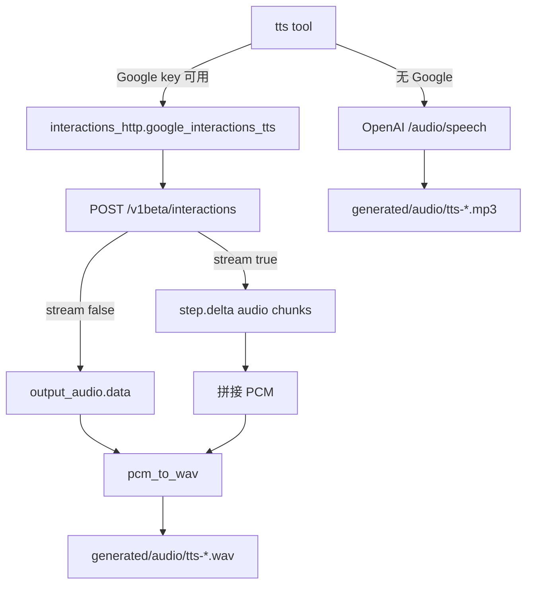

# TTS 升级至 Gemini Interactions API（全量）

日期：2026-07-16  
状态：已实现（见 [实现计划](../plans/2026-07-16-tts-interactions-api.md)）  
参考：[文字转语音生成 (TTS)](https://ai.google.dev/gemini-api/docs/speech-generation?hl=zh-cn)；对齐 [image-gen Interactions 设计](./2026-07-16-image-gen-interactions-api-design.md)

## 背景

升级前 `tts` 工具：

- Google：`POST …/v1beta/models/{tts_model}:generateContent`，`responseModalities: ["AUDIO"]` + `speechConfig.voiceConfig`
- OpenAI：独立 `POST …/audio/speech`（`gpt-4o-mini-tts`）

官方文档已将 **Interactions API**（`POST /v1beta/interactions`）作为 TTS 主推荐接口，并覆盖：

- 单说话人 / 多说话人（最多 2）
- 自然语言风格控制（导演注释 + 音频标记）
- 流式音频（`stream: true`，`gemini-3.1-flash-tts-preview`）
- 30 种预置音色（如 Kore、Puck）

本能力与 OpenAI 兼容页无关；Google 路径不得经 `…/v1beta/openai`。

## 目标

1. Google TTS 主路径改为 Interactions API，对齐官方全量能力（单/多说话人、style、stream 落盘）。
2. 扩展 `tts` 工具参数；与 OpenAI `/audio/speech` 完全分路径。
3. 产物仍写入 `workspace/generated/audio/`；返回 `interaction_id`。
4. 新建 / 扩展 `providers::interactions_http` 骨架（URL + `x-goog-api-key`），供后续 image/vision 复用。

## 非目标

- 前端实时播放 UI
- Live API 交互语音
- 先用其它模型生成播客剧本再 TTS（调用方可链式完成）
- 改造 OpenAI 路径以镜像 `speakers` / `style` / `stream`

## 已确认决策

| 项 | 选择 |
|----|------|
| 范围 | 全量：单/多说话人 + `style` + `stream` 落盘 |
| 实现路径 | 工具层 Google 直连 `interactions_http`；OpenAI 仍走 `/audio/speech` |
| Google 失败 | **不**回退 OpenAI / generateContent；仅当未配置 Google 时走 OpenAI |
| 流式语义 | 聚合 PCM chunk → 最终一档 WAV（不接前端播放） |
| 默认模型 | `gemini-3.1-flash-tts-preview` |
| 重试 | 非流式遇 HTTP 500 最多自动重试 2 次 |

## 架构



旧 `google_tts_generate`（generateContent）保留但标记弃用，工具不再调用。

## 工具契约（`TtsArgs`）

| 参数 | 必填 | 说明 |
|------|------|------|
| `text` | 是 | 待朗读转写（可含 `[whispers]` 等标记） |
| `voice` | 否 | 单说话人音色；Google 默认 `Kore`；OpenAI 默认 `alloy` |
| `speakers` | 否 | `[{ "speaker", "voice" }, …]`，最多 2；与 prompt 角色名一致 |
| `style` | 否 | 导演/风格说明；仅 Google 拼入 `input` |
| `stream` | 否 | 默认 `false`；`true` 时 Interactions 流式并聚合落盘 |

### 校验

- `text` 非空
- `speakers` 长度 > 2 或条目缺字段 → 错误
- 同时给 `voice` 与 `speakers`：以 `speakers` 为准
- OpenAI：高级字段忽略 + `note:` 一行

### Google `input` 拼装

防「风格说明被朗读」与分类器误拒（文档建议）：

```
Synthesize speech for the transcript below. Follow the director notes; do not read the notes aloud.

### DIRECTOR'S NOTES
{style}   // 可选

#### TRANSCRIPT
{text}
```

无 `style` 时仍保留短序言 + `TRANSCRIPT` 块。

### 成功返回（Google）

```
语音已生成：generated/audio/tts-….wav
provider=google
model=gemini-3.1-flash-tts-preview
interaction_id=<id>
stream=true|false
```

## HTTP 细节

**请求**

- URL：`{google_native_base}/v1beta/interactions`
- Header：`x-goog-api-key`（不用 Bearer / `?key=`）；流式另加 `Api-Revision: 2026-05-20`
- Body：`model`、`input`、`response_format: { type: "audio" }`、`generation_config.speech_config`、可选 `stream`

**响应**

- 非流式：`id` + `output_audio.data`（base64 PCM）→ `pcm_to_wav`（24kHz / mono / 16-bit）
- 流式：`event_type=step.delta` 且 `delta.type=audio` 的 chunks 拼接后封装 WAV

**错误**

- 非 2xx：`Google interactions HTTP {status}: {message}`
- 无音频数据：明确报错

## 落地代码

| 路径 | 说明 |
|------|------|
| `crates/agent-providers/src/protocol/interactions_http.rs` | TTS body / 解析 / 流式聚合 / `google_interactions_tts` |
| `crates/agent-tools/src/builtin/media/tts.rs` | Args、校验、Google / OpenAI 分路径 |
| `crates/agent-providers/src/protocol/media_http.rs` | `google_tts_generate` 标弃用 |

## 测试

- Body 拼装：单/双说话人、`stream`、style→input
- 响应解析：`output_audio`、流式多 chunk
- Args 校验：speakers>2、空 text
- 不强制真实 API 集成

## 风险

| 风险 | 缓解 |
|------|------|
| 偶发 500（text token） | 非流式自动重试 2 次 |
| 风格说明被朗读 | 固定序言 + TRANSCRIPT 标记 |
| 长音频质量下降 | 文档限制；调用方自行拆块 |
| SSE 事件格式差异 | 单元测试覆盖多种 delta 形态 |
