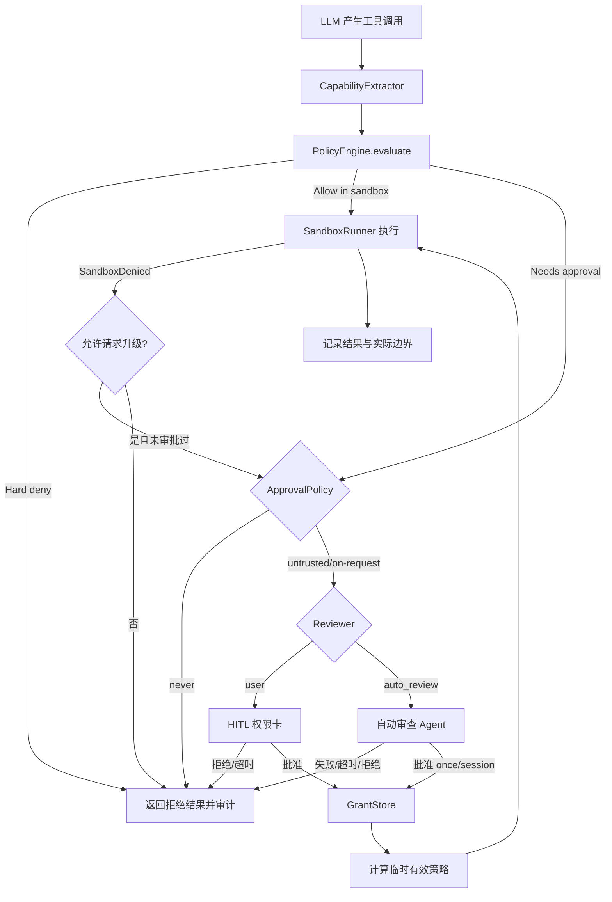

# Codex 风格 Sandbox 与权限系统设计

**日期：** 2026-08-16
**状态：** 已按官方权限文档修订，待分阶段实施
**范围：** Astro Agent 本地工具执行、权限配置、越界审批与桌面端权限选择器
**官方基线：**

- [Sandbox](https://learn.chatgpt.com/docs/sandboxing)
- [Permissions](https://learn.chatgpt.com/docs/permissions)
- [Agent approvals & security](https://learn.chatgpt.com/docs/agent-approvals-security)
- [Auto-review](https://learn.chatgpt.com/docs/sandboxing/auto-review)
- [Agent internet access](https://learn.chatgpt.com/docs/cloud/internet-access)

## 1. 背景

Astro 当前的 `smart | manual | off` 只处理一部分被规则识别为危险的
`terminal` 命令：

- `manual`：危险命令交给用户确认；
- `smart`：辅模型可把危险命令降级为自动放行；
- `off`：除 hardline 外不再询问；
- `file_ops`、`code_exec`、网络工具和 MCP 子进程没有共享的沙箱权限模型；
- `code_exec` 只有环境变量剥离与 rlimit，文档也明确说明它不是硬沙箱；
- `terminal` 子进程直接运行在宿主机上，工作目录约束不等于文件系统隔离。

因此，把这三档直接显示成“请求批准 / 帮我批准 / 完全访问”会造成能力误导：
UI 看起来像 Codex，实际安全边界仍然只是危险命令分类器。

本设计将 **Sandbox（技术边界）**、**Approval Policy（何时询问）**、
**Approvals Reviewer（由谁审批）** 拆成三个独立维度，并用权限预设把它们组合成
用户可理解的入口。

## 2. 设计目标

1. 日常工作默认在可验证的工作区沙箱内完成，减少低风险审批打断。
2. 文件、命令、代码执行、后台任务、网络工具与本地 MCP 使用同一权限决策入口。
3. 越过沙箱边界前先产生结构化权限请求，再按审批策略交给用户或自动审查器。
4. “完全访问”必须真实对应无沙箱执行，不再借用旧 `off` 模式冒充。
5. macOS 首期使用 Seatbelt；架构上预留 Linux `bubblewrap` 与 Windows 原生沙箱。
6. 平台沙箱不可用时失败即阻断，不允许静默退化到宿主机直跑。
7. 现有 Agent / Plan / Ask 工作模式与权限模型正交，不再互相冒充。
8. 所有越界请求、审批结果、临时授权与实际执行边界可审计、可测试。

## 3. 非目标

- 不追求与 Codex 内部实现逐字节一致；对齐的是公开契约与用户可观察语义。
- 首期不承诺通过第三方安全认证，也不把沙箱描述为能抵御所有内核漏洞。
- 不用 Docker 作为桌面端默认沙箱；容器可作为未来自定义执行后端。
- 不把 LLM Provider 的控制面网络请求当作工具网络访问进行阻断。
- 不在本设计中重写浏览器自身的站点权限模型；远程浏览器仍有独立控制。
- 不允许模型自行切换到 `danger-full-access`。

## 4. 核心概念

### 4.1 SandboxMode

```rust
pub enum SandboxMode {
    ReadOnly,
    WorkspaceWrite,
    DangerFullAccess,
}
```

| 模式 | 文件读取 | 文件写入 | 本地命令 | 工具网络 | 越界行为 |
|---|---|---|---|---|---|
| `read-only` | 允许授权读取范围 | 禁止 | 默认禁止 | 按配置 | 产生审批请求或拒绝 |
| `workspace-write` | 允许授权读取范围 | 仅 workspace + writable roots | 在平台沙箱内运行 | 默认关闭，可配置 | 产生审批请求或拒绝 |
| `danger-full-access` | 宿主权限 | 宿主权限 | 无平台沙箱 | 允许 | 不产生沙箱升级请求 |

`danger-full-access` 只移除沙箱边界。组织策略、产品 hard deny 与用户主动取消仍可阻止
操作，但这些限制必须在 UI 中明确显示，不能把它们隐藏成“沙箱”。

### 4.2 ApprovalPolicy

```rust
pub enum ApprovalPolicy {
    Untrusted,
    OnRequest,
    Never,
}
```

- `untrusted`：只有可信规则集命中的操作可直接执行，其他操作先审批。
- `on-request`：沙箱内操作直接执行；明确请求升级或被沙箱拒绝后才审批。
- `never`：永不弹审批；需要升级时直接失败。

### 4.3 ApprovalsReviewer

```rust
pub enum ApprovalsReviewer {
    User,
    AutoReview,
}
```

- `user`：通过现有 HITL 通道向用户展示结构化请求。
- `auto_review`：符合自动审查资格的请求交给独立审查 Agent；不符合资格、审查失败、
  超时或置信度不足时回退用户审批。

自动审查器不能修改 SandboxMode，不能绕过 hard deny，也不能把一次授权扩大成永久授权。

### 4.4 PermissionProfile

```rust
pub struct PermissionProfile {
    pub id: String,
    pub name: String,
    pub description: Option<String>,
    pub extends: Option<String>,
    pub workspace_roots: Vec<PathBuf>,
    pub filesystem: FilesystemPolicy,
    pub network: NetworkPolicy,
}

pub enum FilesystemAccess { Read, Write, Deny }
pub enum NetworkAccess { Allow, Deny }

pub struct NetworkPolicy {
    pub enabled: bool,
    pub domains: BTreeMap<String, NetworkAccess>,
    pub unix_sockets: BTreeMap<PathBuf, NetworkAccess>,
    pub allow_local_binding: bool,
}
```

Profile 只描述**本地命令沙箱的文件系统与网络边界**，不内嵌 approval policy 或 reviewer。
内置 profile 为 `:read-only`、`:workspace`、`:danger-full-access`；自定义 profile 可继承
`:read-only`、`:workspace` 或其他命名 profile，但不得继承 `:danger-full-access`，未知父项、循环
继承和平台无法执行的规则都必须拒绝加载。

文件系统规则使用 `read | write | deny`，更具体路径覆盖更宽路径；同一具体度下优先级为
`deny > write > read`。工作区根中的 `.git`、`.agents`、`.codex` 默认递归只读。

### 4.5 SessionPermissions

```rust
pub struct SessionPermissions {
    pub profile_id: String,
    pub approval_policy: ApprovalPolicy,
    pub approvals_reviewer: ApprovalsReviewer,
}
```

权限 profile、审批策略与审批人是三个正交维度。全局配置提供默认组合，每个会话保存 active
selection。运行时持有解析后的不可变快照；切换权限后通过控制消息原子替换，正在执行的工具
保持原边界，下一次工具调用使用新快照。

## 5. 内置权限预设

| UI 名称 | permission profile | approval_policy | reviewer | 说明 |
|---|---|---|---|---|
| 请求批准 | `:workspace` | `on-request` | `user` | 默认推荐；沙箱内自主执行，越界询问用户 |
| 帮我批准 | `:workspace` | `on-request` | `auto_review` | 边界不变，合格请求交给独立审查 Agent |
| 只读 | `:read-only` | `on-request` | `user` | 检查与回答为主，执行或写入需审批 |
| 完全访问 | `:danger-full-access` | `never` | `user` | 显式高风险模式；无沙箱、无审批 |

“帮我批准”不是更宽的沙箱，只改变审批人。
“完全访问”不是旧 `approvals.mode=off` 的别名。

## 6. 配置与持久化

建议把旧 `approvals:` 段升级为互不混用的 `permissions`、`approval_policy` 与
`approvals_reviewer`，继续存入 `~/.astro/config.yaml`：

```yaml
permissions:
  default_profile: ":workspace"
  profiles:
    project-edit:
      description: 仅编辑工作区并访问 OpenAI API
      extends: ":workspace"
      filesystem:
        workspace_roots:
          "**/*.env": deny
      network:
        enabled: true
        domains:
          api.openai.com: allow
approval_policy: on-request
approvals_reviewer: user
network_proxy:
  enabled: true
```

不能在同一个有效配置中同时启用新 permission profiles 与旧 `sandbox_mode /
sandbox_workspace_write`。若检测到混用，迁移器生成明确诊断并选择新 profile 配置，不允许按加载
顺序产生隐式覆盖。

`network.enabled` 只授予本地命令联网能力；只有 `network_proxy.enabled=true` 时 domain 规则才会
被强制执行。配置了 domain 规则却未启用代理时必须显示高风险错误，不能让 UI 暗示域名已受限。

会话元数据新增：

```text
permission_profile_id
permission_snapshot_hash
permission_updated_at
```

快照 hash 用于审计“本次工具实际在什么边界内运行”，不能只记录当前全局配置。

## 7. 权限请求模型

### 7.1 Capability

```rust
pub enum Capability {
    FileRead { paths: Vec<PathBuf> },
    FileWrite { paths: Vec<PathBuf> },
    ProcessSpawn { program: String, cwd: PathBuf },
    Network { hosts: Vec<String> },
    McpSpawn { server_id: String, program: String },
    ExternalSideEffect { kind: String, target: String },
}
```

一次工具调用可以声明多个 capability，例如 `npm install` 同时需要工作区写入、进程创建与
网络访问。权限引擎对所有 capability 求交集，任一项需要升级时，整个工具调用先停在审批点。

### 7.2 PermissionRequest

```rust
pub struct PermissionRequest {
    pub request_id: String,
    pub session_id: String,
    pub turn_id: Option<String>,
    pub tool_call_id: String,
    pub tool_name: String,
    pub summary: String,
    pub capabilities: Vec<Capability>,
    pub reason: PermissionReason,
    pub requested_scope: GrantScope,
    pub command_preview: Option<String>,
    pub affected_paths: Vec<PathBuf>,
    pub network_hosts: Vec<String>,
}
```

`PermissionReason` 至少区分：

- `OutsideWritableRoots`
- `ReadOnlyMutation`
- `NetworkDisabled`
- `UntrustedCommand`
- `UnsandboxedBackendRequired`
- `RulePrompt`
- `SandboxDenied`

### 7.3 授权范围

```rust
pub enum GrantScope {
    Once,
    Session,
    PersistentRule,
}
```

- `Once`：仅当前 tool_call_id；
- `Session`：当前会话、相同 capability 指纹；
- `PersistentRule`：显式写入规则，必须由用户确认，自动审查器无权选择。

现有 HITL `always` 字段迁移为 `PersistentRule`，不再直接等同于命令字符串白名单。

## 8. 决策与执行时序



约束：

1. 同一个 tool_call 最多进行一次自动重试，避免审批循环。
2. `SandboxDenied` 必须包含结构化拒绝原因，不靠 stderr 文本猜测。
3. 批量并发工具中只要存在审批请求，该调用串行 park；其他无依赖调用可继续并发。
4. 无 HITL 的 cron/Agent Thread 后台场景按 reviewer 决定：可自动审查则审查，否则失败，不得直跑。
5. 自动审查的 prompt 构建、审查会话与结果解析失败全部 fail closed；超时单独上报但不执行。
6. 相同 turn 连续拒绝 3 次，或最近 50 次审查中累计拒绝 10 次时中断本轮，防止模型绕过拒绝。
7. 用户显式覆盖拒绝只能授权完全相同的动作重试一次，重试仍需经过审查器，不能升级成规则。

## 9. 工具能力分类

| 工具/动作 | 主要 capability | workspace-write 默认 |
|---|---|---|
| `file_ops read/list/search` | FileRead | 允许 |
| `file_ops write/append/patch/mkdir/move/copy/delete` | FileWrite | roots 内允许 |
| `terminal run` | ProcessSpawn + 推断的 FileWrite/Network | Seatbelt/bwrap 内运行 |
| `terminal background` | 同 terminal run | 后台进程继承同一沙箱与快照 |
| `terminal status/wait/kill` | 已授权 job 管理 | 仅本会话 job |
| `code_exec` | ProcessSpawn + FileWrite(tmp) + 可选 Network | 沙箱内运行；网络默认拒绝 |
| `web_fetch` 本地 HTTP | Network | 独立的进程内网络策略，不受命令代理自动覆盖 |
| `web_search` 托管工具 | HostedSearch | cached/live/disabled 独立配置 |
| `browser` | ExternalSideEffect/Network | 浏览器权限系统另行裁决 |
| 本地 MCP stdio | McpSpawn + 子工具 capability | MCP 进程必须在沙箱内启动 |
| 远程 MCP | Network + 子工具 side effect | 连接与副作用分别裁决 |
| `delegate/subagent` | 继承父 profile | 只能收窄，不能自行扩大 |
| media/provider 工具 | Network + 可能的计费副作用 | 按工具策略；Provider 控制面例外 |

命令字符串静态分析只能用于生成更准确的 capability 与提示，不能替代 OS 沙箱。

## 10. 平台沙箱架构

新增独立 crate：

```text
crates/agent-sandbox/        package = "sandbox"
  src/lib.rs
  src/policy.rs              纯策略与能力判定
  src/grants.rs              once/session grant
  src/runner.rs              SandboxRunner trait
  src/platform/macos.rs      Seatbelt
  src/platform/linux.rs      bubblewrap
  src/platform/windows.rs    Windows 原生实现
  src/audit.rs
```

共享枚举和 DTO 放入 `agent-types`；配置加载放在 `agent-memory`；工具层只消费已解析的
`EffectivePermissions`，避免 `tools -> memory -> tools` 循环依赖。

### 10.1 SandboxRunner

```rust
#[async_trait]
pub trait SandboxRunner: Send + Sync {
    fn backend(&self) -> SandboxBackend;
    fn probe(&self) -> SandboxHealth;
    async fn spawn(&self, request: SpawnRequest) -> Result<SandboxChild, SandboxError>;
}
```

`probe()` 在应用启动和权限设置页打开时运行，返回 available/degraded/unavailable 及原因。
`workspace-write` 与 `read-only` 在 unavailable 时禁用执行并展示修复建议。

### 10.2 macOS：Seatbelt（首期）

- 使用平台 Seatbelt profile 包裹所有 Agent 派生进程；首期可通过系统
  `/usr/bin/sandbox-exec` 接入，后续评估更稳定的原生绑定。
- 允许读取运行时依赖与明确的项目根；写入只允许 workspace、writable roots 与受控临时目录。
- `network_access=false` 时拒绝子进程网络。
- 拒绝访问敏感用户目录与系统修改接口。
- profile 内容由结构化 builder 生成，所有路径先 canonicalize 并正确转义。
- 后台任务保存 profile hash；轮询和 kill 不改变其创建时边界。

### 10.3 Linux / WSL2：bubblewrap

- 优先使用 PATH 中的 `bwrap`；启动时探测 user namespace 能力。
- 工作区 writable bind，其余运行时路径 read-only bind；使用独立 `/tmp`。
- 默认 `--unshare-net`，启用网络时显式保留网络 namespace。
- bwrap 不可用或 user namespace 被禁用时失败即阻断，并给出安装/配置提示。

### 10.4 Windows

- 原生 PowerShell 路径使用受限 token、Job Object 与文件 ACL/隔离目录组合。
- WSL2 复用 Linux backend。
- Windows backend 未完成前，`workspace-write` 的进程执行必须显示 unavailable，不能退化直跑。

## 11. 文件系统安全

当前 `file_ops` 已有根目录解析和 symlink 校验，但真实权限边界还需要：

1. 将可写根解析为 canonical directory capability；
2. 使用 capability-based 文件 API（建议 `cap-std`）降低检查后替换 symlink 的 TOCTOU 风险；
3. 删除、移动、复制分别检查源和目标 capability；
4. `read-only` 在进入具体文件实现前统一拒绝所有变更动作；
5. 绝对路径只有命中可读/可写根或获得临时授权后才允许；
6. 临时授权不修改全局 profile。

## 12. 子进程与后台任务

`terminal`、`code_exec`、Shell hooks、本地 MCP、delegate 辅助命令必须统一通过
`SandboxRunner`，禁止各模块直接 `Command::new` 绕过边界。

后台任务注册项新增：

```rust
permission_snapshot_hash
sandbox_backend
sandbox_profile_hash
granted_capabilities
```

切换权限 profile 不会扩大已经运行的后台任务；需要更高权限时必须终止并重新启动。

## 13. 网络边界

网络权限分三类，必须在 UI 与配置中分别呈现：

1. **本地命令网络**：profile 的 `network.enabled` 决定是否联网；启用代理后才按 domain、Unix
   socket 与本地/私网规则过滤，由 Seatbelt/bwrap/Windows backend 强制；
2. **进程内/托管工具网络**：`web_search`、`web_fetch`、MCP、Browser、Computer Use、Apps 和
   Provider 控制面各自使用独立开关与审批，不能宣称受命令代理统一保护；
3. **云端 Agent 网络**：环境级独立配置，setup 阶段可联网，agent 阶段默认离线；可选择空白、
   常用依赖或全量域名预设，并单独限制 HTTP methods。

LLM Provider 的聊天流、模型列表等控制面连接不受工具 profile 阻断，否则 Agent 无法工作；
但它们必须受自身的服务连接和组织策略约束。命令网络域名规则采用 allowlist-first：精确 host、
`*.example.com`（仅子域）、`**.example.com`（根域与子域）和 allow-only 的 `*`；deny 总是胜出。
默认阻断 loopback、link-local 与私网地址，通配符不能作为本地例外，DNS 解析失败或解析到非公网
地址时拒绝。首期如果不能同时交付网络代理，就只提供网络全关，不能提供未兑现的 host allowlist。

## 14. 自动审查

复用现有辅助模型路由，但替换脆弱的“文本含 AUTO”协议，使用结构化结果：

```json
{
  "decision": "approve_once | approve_session | deny",
  "reason": "...",
  "risk": "low | medium | high"
}
```

自动审查是 reviewer 替换，不是 permission grant。它只处理原本就需要交互审批的 eligible 请求；
`approval_policy=never` 不会产生审查。审查上下文仅包含压缩后保留的会话记录与精确请求，不依赖
主 Agent 隐藏推理。以下请求始终拒绝或要求用户先切换 reviewer：

- `danger-full-access` 切换；
- 永久规则写入；
- hard deny；
- 修改权限配置本身；
- 凭证、系统安全设置或不可逆外部副作用；
- 审查模型不可用、超时、输出无效或上下文不足；
- Computer Use 中仍要求用户直接批准的 app approval。

审查结果记录 `reviewing | approved | denied | aborted | timed_out`、风险等级与用户授权判断；每个
任务最多保留最近 10 条拒绝，供下一次审查识别重复绕过。组织下发的 reviewer policy 与 profile
allowlist 优先于本地配置，被省略的 profile（含未来新增内置项）一律视为禁止。

## 15. Rules

```rust
pub enum RuleEffect { Allow, Prompt, Forbid }

pub struct PermissionRule {
    pub id: String,
    pub effect: RuleEffect,
    pub tool: Option<String>,
    pub command_prefix: Option<Vec<String>>,
    pub path_glob: Option<String>,
    pub host_glob: Option<String>,
    pub note: Option<String>,
}
```

优先级固定为：

```text
Admin Forbid > User Forbid > Session Grant > Persistent Allow > Profile Boundary > Default Policy
```

规则只决定允许、询问或禁止，不能把 workspace-write 变成全盘无沙箱。需要超出技术边界时仍须
生成显式 elevation grant。

## 16. UI 设计

输入区保留两个互相独立的控件：

```text
[ Agent ▾ ] [ 请求批准 ▾ ] [ 并行任务 ] [ 思考级别 ... ]
```

权限菜单：

1. 请求批准 — 工作区内自主执行，越界询问我；
2. 帮我批准 — 工作区边界不变，符合条件的请求交给审查 Agent；
3. 只读 — 仅检查和回答，执行或写入需批准；
4. 完全访问 — 不限制文件和网络，不请求批准（警告色 + 二次确认）；
5. 自定义权限 — 跳转权限设置页。

菜单底部显示当前平台后端健康状态，例如：

```text
macOS Seatbelt · 已启用
网络：关闭 · 可写根：当前项目 + 1
```

审批卡至少展示：工具、命令摘要、文件路径、网络 host、越界原因和授权范围；不得只显示一段
模糊的“是否允许”。

> **现状补充（实现对齐，2026-09-27）**：上面的菜单之外，权限菜单现在还会显示
> 「本会话额外权限」卡片（列出 `request_permissions` 批准的可写根 + 撤销按钮），
> 胶囊上有 `+N` 角标；撤销走 `RevokeSessionPermissionGrants`。
> 沙箱重试卡的「命令摘要」现在直接给可复制/可编辑的命令，并提供
> 「在终端打开（预填不执行）」与「编辑后重试」（= 拒绝原请求 + 用修改后的命令重试）。
> 高风险（dangerous）审批要求显式点击或 ⌘/Ctrl+Enter，`Esc` 只回退二阶确认。

完全访问二次确认必须明确：

- 将移除文件系统与网络沙箱；
- 后续操作不会弹出审批；
- 选择只对当前会话还是修改默认 profile。

## 17. Tauri / gRPC 契约

Tauri 命令：

```text
get_permission_profiles
set_default_permission_profile
upsert_permission_profile
delete_permission_profile
get_sandbox_health
set_session_permission_profile
list_permission_rules
upsert_permission_rule
delete_permission_rule
```

后端会话需要支持：

```text
ChatRequest.permission_profile_id
ChatControl.UPDATE_PERMISSIONS
SessionEvent.permission_changed
```

不能只由 Tauri 写本地 YAML 再假设 backend 立即看见；活会话必须收到版本化快照或更新事件。

## 18. 审计与可观测性

新增事件：

- `permission.evaluated`
- `permission.requested`
- `permission.reviewed`
- `permission.granted`
- `permission.denied`
- `sandbox.spawned`
- `sandbox.denied`
- `sandbox.backend_unavailable`

事件保存 capability 摘要、profile/snapshot hash、scope、reviewer、结果和耗时；命令与路径按现有
隐私规则截断，不记录凭证或完整环境变量。

## 19. 迁移策略

旧配置不能直接扩大权限：

| 旧值 | 新默认迁移 | 原因 |
|---|---|---|
| `manual` | 请求批准 | 语义最接近 |
| `smart` | 帮我批准 | 保留自动审查意图，但新增真实 workspace 沙箱 |
| `off` | 请求批准 + 迁移提示 | 旧 off 只关闭部分命令审批，不能静默升级为全盘访问 |

旧 `command_allowlist` 先作为 legacy terminal 规则只读导入，逐条转换成新 Rules 后再删除旧字段。
迁移完成前保留回滚备份。任何未知值均回退“请求批准”。

## 20. 失败语义

| 场景 | 行为 |
|---|---|
| 平台 backend 不可用 | 阻断进程执行，显示诊断；不直跑 |
| 权限配置损坏 | 使用内置“请求批准”安全默认并报警 |
| 无 HITL 且需要用户批准 | 返回结构化 denied，不执行 |
| auto review 构建/会话/解析失败 | fail closed；不自动回退或执行 |
| auto review 超时 | 记录 timed_out 并拒绝执行 |
| profile 在当前平台无法完整执行 | 拒绝激活，不降级成较宽策略 |
| profile 与旧 sandbox 配置混用 | 迁移诊断并使用显式新配置，不按层级静默覆盖 |
| domain 规则存在但网络代理关闭 | 阻止保存/激活受限网络声明，提示实际为直连 |
| 沙箱启动失败 | 不使用无沙箱重试 |
| 工具漏声明 capability | 默认按高风险处理并记录开发错误 |
| 权限切换发生在执行中 | 当前调用保持旧快照，后续调用使用新快照 |

## 21. 测试策略

### 21.1 纯策略单元测试

- 三种 SandboxMode × 三种 ApprovalPolicy × 两种 Reviewer；
- profile 继承、循环检测、路径具体度与 `deny > write > read`；
- 网络授权与代理过滤的组合矩阵、domain wildcard、私网默认拒绝；
- 新 permission profiles 与旧 sandbox 设置互斥；
- once/session/persistent grant 生命周期；
- 旧配置迁移不扩大权限。

### 21.2 文件系统集成测试

- workspace 内写入成功；
- workspace 外写入被拒；
- symlink 指向 workspace 外被拒；
- read-only 下所有变更动作被拒；
- 临时 once grant 只允许一次。

### 21.3 进程沙箱测试

- shell 可读取运行时并在 workspace 写文件；
- 尝试写 `~/` 非授权目录被 Seatbelt/bwrap 拒绝；
- `network_access=false` 时 curl/socket 失败；
- 子进程、孙进程和后台任务继承相同边界；
- backend 不可用时失败即阻断。

### 21.4 审批集成测试

- on-request 越界产生一次 HITL，批准后只重试一次；
- never 越界直接失败；
- auto_review 结构化批准、拒绝、超时、fail-closed 与拒绝熔断；
- 后台执行无用户审批时不误执行；
- hard deny 永不被自动审查或 session grant 覆盖。

### 21.5 前端测试

- 权限预设映射正确；
- 完全访问二次确认；
- 后端不可用/降级状态可见；
- 当前会话与默认 profile 修改边界清晰；
- 旧 `smart/manual/off` UI 不再出现。

## 22. 分阶段落地

### Phase 0：撤销误导语义

- 权限 chip 不再把 `smart/manual/off` 命名成 Codex 权限预设；
- 设置页明确标注旧功能只覆盖危险命令；
- 保留旧逻辑作为迁移期 fallback。

### Phase 1：权限内核与配置

- `agent-types` 新增 profile、selection、网络与审批 DTO；
- 新建 `agent-sandbox` 的 policy/grants/audit；
- `agent-memory` 持久化 profiles 并完成安全迁移；
- Tauri/grpc 暴露 profile 与 health。

### Phase 2：macOS 真沙箱

- Seatbelt runner；
- terminal/code_exec/background jobs/本地 MCP 统一接入；
- file_ops capability 边界；
- 启动探测与失败即阻断测试。

### Phase 3：统一审批与自动审查

- generic PermissionRequest + HITL；
- once/session/persistent grants；
- structured auto review；
- cron/delegate/Agent Thread 后台执行失败语义。

### Phase 4：桌面 UI

- 输入区权限预设；
- 自定义 profile 设置；
- sandbox health、审批卡和审计展示；
- 移除旧审批 UI。

### Phase 5：Linux / Windows

- bwrap backend 与发行版诊断；
- WSL2 复用；
- Windows 原生 backend；
- 跨平台一致性测试。

每个 Phase 独立提交、独立回滚。Phase 2 未完成前不得把 UI 标记为“工作区沙箱已启用”。

## 23. 验收标准

1. 默认“请求批准”下，Agent 能在当前项目内编辑和运行常规测试而不频繁打断。
2. 同一模式下，命令无法写入未授权目录，也无法使用未授权网络。
3. 越界操作在执行前产生包含具体路径/host/原因的审批请求。
4. “帮我批准”只改变 reviewer，不改变 workspace 边界。
5. “完全访问”确实取消平台沙箱与审批，并经过显式二次确认。
6. 沙箱 backend 故障不会导致宿主机无沙箱执行。
7. file_ops、terminal、code_exec、后台任务与本地 MCP 无绕过路径。
8. 旧 `off` 不会在迁移后静默获得 `danger-full-access`。
9. 审计记录能还原每次工具调用使用的 profile、快照和临时授权。
10. macOS 安全测试、Rust 单测、前端类型检查与集成测试全部通过。

## 24. 待评审决策

1. macOS 首期是否接受 `/usr/bin/sandbox-exec` 作为 Seatbelt 接入，还是直接实现原生绑定？
2. `workspace-write` 的默认读取范围是全用户目录只读，还是仅项目与运行时依赖？本设计建议后者。
3. 网络代理不能同批交付时，首期是否保持命令网络全关？本设计建议保持全关，不暴露伪 allowlist。
4. 自动审查允许 `approve_session`，还是首期只允许 `approve_once`？本设计建议首期只允许 once。
5. 完全访问是仅当前会话，还是允许设为全局默认？本设计建议允许全局默认，但需要额外确认。
